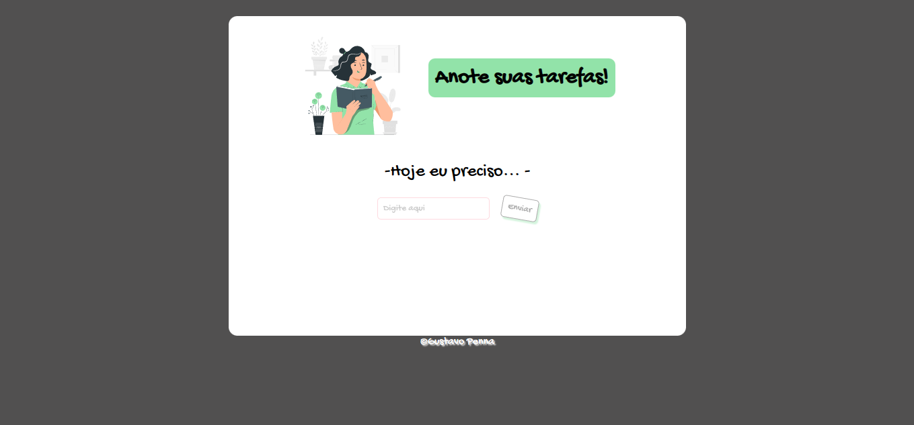

<h1 align="center">To-do</h1>

  <a href="#-tecnologias">Tecnologias</a>&nbsp;&nbsp;&nbsp;|&nbsp;&nbsp;&nbsp;
  <a href="#-projeto">Projeto</a>&nbsp;&nbsp;&nbsp;|&nbsp;&nbsp;&nbsp;
  <a href="#-layout">Layout</a>

 

  

## 🚀 Tecnologias

Esse projeto foi desenvolvido com as seguintes tecnologias e bibliotecas:

- HTML
- CSS
- JavaScript
- [Ionicons](https://ionic.io/ionicons)

## 💻 Projeto

Projeto criado para estudos básicos de Javascript.

- [x] Adicione e remova itens na lista.
